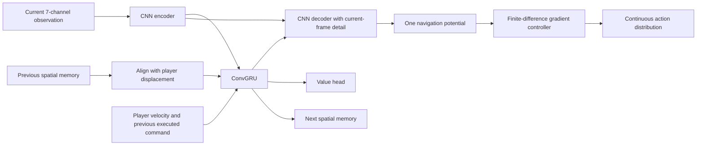

# Spatial memory and a navigation potential for DodgeRoyale

**Date:** 2026-09-19  
**Status:** Planned; implementation has not started.  
**Architecture name:** `spatial-potential-royale-v1`  
**Predecessor:** [VelocityFlow implementation](2026-09-15-velocity-flow-royale-implementation.md)

## Intended result

Train a policy that remembers recent spatial observations, produces **one
64 x 64 navigation potential**, and derives continuous steering from that
potential's negative gradient. The learned model interprets the scene and its
history; a small, separately testable arithmetic controller converts the map
into movement. The critic estimates episode return separately.

The map is conditioned on history and player motion. It replaces the six
horizon-specific outputs for this architecture; it is not their weighted
average. Decisions remain one per 60 Hz simulation step. Keep the intentional
256-reference-pixel observation window and the existing velocity channels.

The initial deliverable is a working, measurable alternative to the continuous
VelocityFlow baseline. Better survival is an experimental acceptance criterion,
not something the architecture alone establishes. Keep the baseline selectable
until comparisons justify changing the default.

All implementation belongs to this repository. The Rust gym owns simulation;
Python owns model memory, training, and inference. DodgeAI is not a dependency.

## Integration checkpoint: continuous controls

This plan was prepared while another agent's continuous-control changes were
uncommitted on `main` at `0f7c66d`. Re-read their completed implementation before
editing shared files. In the inspected working tree:

* `policies.py` blends nine path headings into a Gaussian mean via
  `_FieldDirection`; `RoyaleVecEnv` exposes `Box(-1, 1, shape=(2,))`.
* Gym protocol v2 and `tests/fixtures/gym-v2/` are being introduced. The nine
  paths are still observation probes, independent of the two action values.
* `intent_from_command` treats command lengths below 0.2 as idle;
  `advance_motion` normalizes other commands to a fixed target speed. This is
  continuous **heading**, not variable-speed analog movement.
* `src/gym/workers.rs` advances exactly one frame per STEP. The browser
  autopilot currently uses a 24-frame hold and comments claiming training does
  the same. Those claims conflict with the inspected worker and VecEnv.
* The browser watcher runs `predict` and the field renderer as two separate
  forward passes. A recurrent model must produce both in one memory update.

Treat completion and verification of the continuous action contract as Task 1's
dependency. Do not restart that migration or edit its fixtures concurrently.
Pure model/controller work can proceed independently. Record the integrated
revision in the eventual results; this document is not a claim that the working
tree currently passes its gates.

## Design decisions

### What the potential means

`U_t(x, y)` is a learned navigation heuristic for the current player and
history. Lower values should induce actions with better expected survival.
It is neither calibrated collision probability nor a proven cost-to-go value.
Its values can be signed, and subtracting its spatial mean removes an irrelevant
additive offset without changing its gradient.

One 2D scalar map compresses information. It cannot explicitly retain every
arrival time, velocity, route choice, or action-dependent enemy response. Memory
can make the map more useful, but does not remove that limitation or eliminate
local minima. In particular, immediate visual brightness is not proof of
immediate collision danger. Label the overlay **navigation potential**.

Train the encoder, memory, decoder, and critic jointly from the existing PPO
reward. The arithmetic controller remains differentiable with respect to the
map. This teaches a task-useful representation, but does not establish that all
4096 cells have meaningful hazard semantics. Test navigation outcomes and history
sensitivity, not visual resemblance to hazard occupancy.

Supervised hazard prediction, a Bellman-trained spatial value map, and alternate
planners are later experiments with explicit target definitions. Do not label a
single realized enemy trajectory as the counterfactual future for every route:
enemies can react differently when the player moves differently.

### Model and state ownership



Start with these configurable sizes, recorded in checkpoints:

| Item | Initial value |
|---|---|
| Encoded observation | 7 x 64 x 64, layout-driven channel lookup |
| CNN features / ConvGRU state | 64 x 16 x 16 |
| Recurrent cell | One ConvGRU with 3 x 3 convolutions |
| Decoder output | 1 x 64 x 64, linear output |
| Current-frame detail | Encoder skip features at 64 x 64 and 32 x 32 |
| Motion conditioning | Player velocity, previous executed command, previous-step validity |
| Initial recurrent rollout | 8 envs x 256 frames |
| Training chunk | 32 loss-bearing frames plus up to 8 preceding burn-in frames |
| Sequence minibatch | 2 chunks, independent of env count |
| Decision cadence | Exactly one action per simulated 1/60 second |

The coarse recurrent state should remember motion; skip features preserve small
hazards that pooling to 16 x 16 could erase. Do not use dropout or batch-dependent
normalization in the first implementation, so sequential and replayed inference
have the same semantics.

Use one shared recurrent core for actor and critic initially. The value head
reads its features and motion inputs, rather than deriving value from the
potential alone. Actor and critic losses both train the shared core. This avoids
duplicating a spatial hidden state per environment; separate cores are an ablation.

Expose explicit, functional interfaces rather than state hidden inside modules:

```text
step(observation, memory, episode_start, previous_command)
    -> action_distribution, value, potential, next_memory
sequence(observations, initial_memory, episode_starts, previous_commands, masks)
    -> distributions, values, potentials, final_memory
```

`memory` contains the spatial tensor and previous player velocity/validity needed
for alignment. Callers own and replace it. Reading an overlay or evaluating a
bootstrap value must not advance live memory. Training has one state per env;
each browser watch session has its own state.

Convolutional recurrence is an established way to retain spatial structure in
temporal features; the proposed dimensions and controller remain our experiment.
See [Ballas et al., convolutional GRUs](https://arxiv.org/abs/1511.06432).

### Alignment and its limits

Keep all model coordinates in reference pixels with Y down. For actual player
displacement `delta`, align the old state by sampling:

```text
aligned_memory(x, y) = previous_memory(x + delta.x, y + delta.y)
normalized sampling offset = 2 * delta / window_pixels
```

Thus a stationary threat shifts left in memory when the player moves right.
Use bilinear `grid_sample`, `align_corners=False`, zero padding, and a warped
validity mask as a cell input. Newly exposed regions are unknown prior memory,
not evidence of safety. Do not wrap the local tensor like a torus: the global
arena wraps, while the observation window is a crop.

For a single known simulation step, calculate displacement from the executed
command and previous velocity using the same integrated exponential motion as
`advance_motion`, including its idle rule. In common units:

```text
v_next = v_target + (v_previous - v_target) * exp(-response * dt)
delta = v_target * dt + (v_previous - v_next) / response
```

Use the clipped command actually sent to the gym, not the Gaussian sample before
clipping or its mean. Generate Rust motion fixtures carrying the constants and
motion-contract identifier; the Python calculation must match those fixtures.
Velocity observations are scaled end-of-frame velocities, not integrated
displacements. `velocity * dt` alone is insufficient during acceleration.
At frame zero/reset, clear the state and skip alignment. Terminal observations
on timeout are aligned using the final executed action before bootstrap.

The same small physical displacement crosses a world seam; never interpret that
as a screen-width jump. Keep world-to-observation Y conversion at a named boundary.
The current target-speed bounds make player velocity encoding unclipped; assert
that precondition and reject an incompatible motion contract.

This fixed-size memory does **not** guarantee persistent tracking outside the
window: shifted-out cells are discarded, and later observations cannot recover
them exactly. ConvGRU gates can retain summaries within the remaining state.
Repeated fractional shifts also blur features; measure that effect and include
an alignment-disabled ablation. A larger/global memory is outside this plan.

### Controller and learning objective

Implement the first controller as a pure module:

1. Smooth `U` with a fixed normalized 3 x 3 binomial kernel.
2. Compute central-difference X/Y gradients in potential units per reference
   pixel, using replicated boundaries rather than an artificial zero rim.
3. Sample the gradient at the predicted inertial stopping offset from the
   player's centre (`velocity / response`), capped at 32 reference pixels.
   This offset uses zero-input braking in the actual motion model. Expose a
   zero-lookahead ablation; do not confuse it with the old path hold.
4. Convert sampled gradient `g` to a bounded mean:
   `mean = -g / sqrt(dot(g, g) + gradient_scale**2)`, with positive
   `gradient_scale` recorded in the model config (initial value 1.0).
5. Convert Y down to the finalized continuous command convention once. Use a
   diagonal Gaussian around the mean, initially `log_std=-1`, as in the
   continuous baseline. Clip samples to the env's Box before execution.

Store/log-prob the original Gaussian sample for PPO; separately retain the
executed clipped action for dynamics and memory. Idle threshold and normalization
remain environment semantics. Small output magnitude does not promise slow travel.
Constant maps produce a zero mean; exploration can still move the player.

Finite-difference convolutions let ordinary backpropagation train the map through
the controller. Do not differentiate `U` with `autograd.grad` inside an optimized
trajectory solver in this version. Gradient clipping, finite checks, and measured
gradient norms cover stability without promising that a smooth map avoids traps.
Do not add a learned residual controller or new reward terms during this experiment.

### Sequence training rather than a stateful feature extractor

Ordinary PPO's shuffled, independent samples cannot train this recurrence
correctly. SB3 Contrib's supplied recurrent implementation specifically allocates
actor/critic LSTM hidden and cell states; it is not a drop-in ConvGRU buffer.
See its [RecurrentPPO implementation](https://github.com/Stable-Baselines-Team/stable-baselines3-contrib/blob/master/sb3_contrib/ppo_recurrent/ppo_recurrent.py)
and [state/reset contract](https://sb3-contrib.readthedocs.io/en/master/modules/ppo_recurrent.html).

Implement a narrow repository-local `SpatialPPO` subclass of the installed SB3
PPO with sequence-aware collection/training and a `SpatialRolloutBuffer`. Reuse
SB3's distribution, optimizer, callbacks, save/load, logging, and PPO loss
semantics. Adapt only the necessary recurrent collection/unroll logic, recording
the exact upstream revision/version and licenses if code is copied. No new ML
framework or `sb3-contrib` runtime dependency is needed for this chosen approach.

Keep raw observations and transition metadata on the host. Store detached hidden
states at chunk burn-in starts, not at every frame. Replay burn-in using current
weights under no-grad, then unroll each loss-bearing sequence with gradients.
Shuffle chunks, not timesteps; never connect two envs' histories. Episode starts
zero state before consuming that observation, even within a chunk. Mask padding
and burn-in from every loss, advantage normalization, entropy, and KL calculation.

Each rollout transition contributes one loss-bearing slot per PPO epoch. Burn-in
may reuse preceding observations but carries no additional loss. The first chunk
uses the saved incoming rollout state, with a shorter/empty burn-in. Retain and
detach live memory across rollout boundaries; a PPO update is not an episode reset.
Stored states become approximate after weight changes. Burn-in reduces that
staleness but does not make it exact; document and measure this tradeoff.

A 64 x 16 x 16 float32 state costs 64 KiB per env. Saving it at every step of an
8 x 1024 rollout costs **512 MiB for hidden state alone**. The proposed 8 x 256
rollout holds about **225 MiB of raw observations**, plus roughly 4 MiB of
chunk-start states before metadata and activations. These are storage estimates,
not peak host/GPU memory measurements. Size minibatches by sequences and measure
activation peaks before increasing them.

Handle terminal observations carefully: bootstrap a pure timeout with the
finished episode's next observation and memory. Death, including simultaneous
death/timeout, does not bootstrap. Clear memory before consuming the auto-reset
observation. Last-value estimates at rollout boundaries are functional reads;
they must not cause the same observation to update memory twice.

## Tasks and checkpoints

Every checkbox below is acceptance work, not a completion report. Implement in
dependency order, keeping checkpoints buildable and reporting evidence at each
stage. Preserve other agents' changes and stop only work whose dependency has
not landed.

### Task 1 - Freeze the action, time, and motion contracts

**Dependency:** completed continuous-control migration.  
**Files:** inspect `src/simulation.rs`, `src/motion.rs`, `src/gym/`,
`training/dodge_royale/{protocol,vec_env,policies}.py`; add
`examples/motion_fixtures.rs`, `tests/fixtures/player-motion/`,
`training/tests/test_motion_reference.py` and a focused Rust fixture test.

- [ ] Record protocol/action axes, clipping, idle threshold, normalization,
  movement constants, timestep, reward config and the integrated revision.
- [ ] Prove STEP consumes one action and advances one reference frame;
  `hold_frames` controls observation predictions only. Confirm both languages'
  continuous golden fixtures and learner smoke checks pass first.
- [ ] Emit independent expected position/velocity/displacement sequences for
  rest, acceleration, reversal, braking, diagonal and non-compass headings,
  clipped commands, idle threshold boundaries, and both seams.
- [ ] Record a motion-contract identifier in fixture metadata/checkpoints and
  arrange a Rust test that detects stale constants against this build.

**Accept:** Python matches the Rust fixture displacements within an explicit
float32 tolerance (start at 1e-4 reference px per step; investigate failures
before relaxing it). A 600-step accumulated trace stays within 0.02 reference px.
Do not regenerate expected data with the Python formula under test.

### Task 2 - Implement spatial memory and alignment primitives

**Dependency:** motion contract for alignment; the ConvGRU cell can start earlier.  
**Files:** create `training/dodge_royale/spatial_memory.py` and
`training/tests/test_spatial_memory.py`.

- [ ] Define typed state and config, reset/select/clone/detach operations, a
  motion adapter, and a convolutional GRU cell with explicit update/reset gates.
- [ ] Implement signed fractional alignment, validity mask, and first-frame
  handling. State inputs are immutable from the caller's perspective.
- [ ] Use learned retention gates first; log their statistics. Do not impose
  an arbitrary fixed decay and claim it produces correct hazard lifetimes.

**Accept:** an impulse at a stationary world location shifts correctly when the
player moves, including Y and seam cases. Cover zero/integer/fractional shifts,
newly exposed strips, full-window displacement, independent batch resets, and
finite backward gradients. Quantify interpolation blur on a long shift sequence;
fractional forward/backward warps are not expected to recover lost detail exactly.

### Task 3 - Build the encoder, recurrent decoder, and critic

**Dependency:** 2.  
**Files:** create `training/dodge_royale/potential.py`,
`training/tests/test_potential.py`; reuse layout decoding from `velocity.py`.

- [ ] Build the CNN/downsampling, motion conditioning, ConvGRU, skip-connected
  decoder, and value head using the initial shapes above.
- [ ] Produce one linear potential map, centre its spatial mean, and expose a
  single forward result containing map, value, and next memory.
- [ ] Keep all seven input channels. The new network need not consume the old
  nine paths, but retains the existing observation layout for comparisons.
- [ ] Provide `memory_enabled=False` as a separately recorded configuration:
  force zero recurrent input each decision for a same-controller baseline.

**Accept:** step-by-step inference and sequence unroll agree with frozen weights.
Changing history can change a later map for the same current observation; episode
reset removes that influence. Real fixture observations produce finite outputs
and gradients in encoder, memory, decoder, and critic. Small visible hazards are
represented in current-frame skip features; shape checks alone are insufficient.

### Task 4 - Implement and validate the gradient controller

**Dependency:** pure synthetic tests can start immediately; connect after 3.  
**Files:** create `training/dodge_royale/potential_control.py`,
`training/tests/test_potential_control.py`.

- [ ] Implement the fixed smoothing, derivatives, stopping-offset sample,
  bounded action mean, and named coordinate conversion from the design.
- [ ] Keep controller parameters checkpointed and make its API accept any
  potential map. Inspect action mean, gradient norm, sampling location and idle
  frequency without running a second model pass.
- [ ] Preserve Gaussian sample/log-prob and executed-action separation.

**Accept:** planted sloped planes yield the known downhill direction and scale;
quadratic wells give opposing directions on opposite sides. Constant, symmetric,
tiny-gradient and non-finite cases have defined behavior. Check Y conversion,
cell-size scaling, braking lookahead, Box clipping and idle threshold. A policy
loss backpropagates into the potential and ConvGRU with first-order operations.

**Checkpoint A:** forward inference and geometric/controller tests pass, with a
reviewable visualization of synthetic potentials, sampled gradients and actions.

### Task 5 - Implement the sequence rollout buffer

**Dependencies:** 2 and the finalized state interface.  
**Files:** create `training/dodge_royale/spatial_buffer.py`,
`training/tests/test_spatial_buffer.py`.

- [ ] Store observations, original actions, executed commands, episode masks,
  rewards, old log-probs/values, returns/advantages, and burn-in-start states.
- [ ] Yield chronological chunks with explicit padding/loss masks and bounded
  sequence minibatches. Build alignment metadata from executed actions and
  observations, not a current policy's newly sampled actions during replay.
- [ ] Cover short rollouts, partial chunks, resets in burn-in and loss regions,
  and rollouts starting mid-episode without storing hidden state per timestep.

**Accept:** numbered multi-env traces prove sequence order, no cross-env history,
correct reset boundaries, one loss slot per transition per epoch, and no mutation
of retained observations/states. With frozen weights, replayed means, values and
log-probs agree with collection before any optimizer step. Assert allocated state
storage scales with chunks, not frames.

### Task 6 - Integrate spatial recurrence with PPO

**Dependencies:** 3-5.  
**Files:** create `training/dodge_royale/spatial_policy.py`,
`training/dodge_royale/spatial_ppo.py`, `training/tests/test_spatial_ppo.py`;
extend `policies.py` and `training.py` only after the parallel migration settles.

- [ ] Implement state-aware collection, sequence evaluation and masked PPO
  optimization. Preserve SB3 clipping, GAE, entropy/value coefficients, learning
  rate schedule, gradient clipping, KL early stop and callback lifecycle.
- [ ] Implement functional timeout and rollout-boundary bootstrap, followed by
  per-env reset handling. Carry state across rollouts and detach graphs.
- [ ] Extend architecture registration to select algorithm class and policy
  config, so building/loading is not hard-coded to `PPO` everywhere.
- [ ] Make snapshots count completed optimizer updates consistently, preserving
  the final update and never publishing an untrained rollout as a learned update.
- [ ] Pin/test the supported SB3 version and record any adapted source/licensing.

**Accept:** a short real-gym rollout completes an update with verified changes to
ConvGRU and decoder parameters. Masked samples do not change losses; forced mixed
death/timeout/continuation batches use correct states and bootstrap targets.
No weights changed implies replay likelihood ratios near one. Verify that a
loss at a later frame reaches earlier recurrent computation within its chunk,
and cannot cross a reset or detached burn-in boundary. Pause/stop/save callbacks
still release children, and checkpoints contain trained recurrent weights.

**Checkpoint B:** real continuous PPO learning works with spatial memory, with
measured memory usage and all recurrence/lifecycle tests passing.

### Task 7 - Add configuration, checkpoint compatibility, and diagnostics

**Dependency:** 6.  
**Files:** `training/dodge_royale/{training,train,policies,metrics,worker,history}.py`,
their tests, and the eventual `training/README.md` update.

- [ ] Add the architecture option and validated memory/chunk/burn-in settings
  to the shared session config. CLI and dashboard must build the same model.
- [ ] Save architecture revision, input layout, continuous action convention,
  motion contract, controller parameters, state shape and decision cadence.
  Wrong architecture/layout/cadence fails before inference or env attachment.
- [ ] Load through the algorithm registry in training, evaluation and watchers.
  Existing VelocityFlow checkpoints retain their own load path; initializing a
  new architecture from them is not an automatic weight migration.
- [ ] Weights/optimizer/config are durable checkpoint state. A new training
  process or viewer starts a fresh episode with zero memory; exact continuation
  of a live arena plus hidden state is not claimed.
- [ ] Add registry metrics for inference time, sequence update time, memory norm,
  gate saturation, gradient norm, idle rate, action change and simulated FPS.
  Keep histories bounded and feed all metrics from the existing collector.

**Accept:** save/load reproduces outputs for the same observation history.
Same-shaped incompatible checkpoints fail clearly. Resuming a run starts clean
episode state, while pausing/resuming a live run retains state. Configuration
validation rejects impossible sequence sizes before launching a child process.

### Task 8 - Make browser watching stateful and match simulation cadence

**Dependencies:** 6-7 and the integrated continuous browser bridge.  
**Files:** `training/dodge_royale/{browser_watch,watching,viewer,dashboard}.py`,
`src/game/autopilot.rs`, `web/index.html`, and focused watch/browser tests;
shared simulation time plumbing only where required for fixed watch steps.

- [ ] Return action, potential and next memory from one inference. Rendering,
  UI refresh, and metrics reads consume that saved result and never update state.
- [ ] Give each watch instance explicit episode and request sequence IDs.
  Process accepted observations once, cache a duplicate reply, and reject stale
  or out-of-order requests without mutating memory. Serialize episode reloads
  and inference under the existing ownership lock. Version this local HTTP
  envelope explicitly, independently of the gym's binary protocol; validate
  model/motion/cadence compatibility before accepting its first observation.
- [ ] Start/reset with zero memory, previous command and validity. Adopt a new
  snapshot only at an episode boundary. A failed load retains the old weights,
  but the new episode still clears their memory. Reconnect begins a fresh episode.
- [ ] For this architecture, run the browser simulation one fixed reference
  step per accepted action, with rendering continuing while inference is pending.
  Request the next action from the resulting next observation. Pace simulation
  to at most 60 steps/s, avoid a second outstanding decision, and do not silently
  skip recurrent observations or hold an action for `hold_frames` frames.
- [ ] Separate the simulation step clock/gate from rendering and visual effects.
  All player/enemy motion, blast age, contacts and population systems use that
  same step. Audit their current `Res<Time>` reads; merely gating Update while
  leaving wall-clock delta in those systems does not make a 60 Hz step.
- [ ] If inference cannot sustain 60 steps/s, show actual simulated FPS/real-time
  ratio and slow simulation. Render interpolation may smooth display transforms
  without mutating authoritative positions. A slow model is a measured limit,
  not a reason to run it on a different observation cadence.
- [ ] Preserve the stable iframe, normal Bevy art, no-menu watch startup, disabled
  keyboard capture, and atomic snapshot publication. Overlay the one potential
  at its source observation's anchor and label its meaning accurately.

**Accept:** a scripted inference bridge at normal, delayed and duplicate response
timings advances memory and simulation once per accepted command. Obsolete
episode responses cannot affect a new game. Replaying the same observation/action
sequence through the Python watch and training paths gives matching state/maps.
A real browser test covers death/restart, snapshot adoption, reconnect, focus,
overlay refresh, and continued rendering while awaiting inference.

**Checkpoint C:** the recurrent model controls the real game in the iframe with
matching state/time semantics and no second inference for the overlay.

### Task 9 - Run comparisons that isolate the architectural changes

**Dependencies:** 6-8.  
**Files:** extend `training/tools/benchmark_royale.py`; create a focused evaluation
tool and tests, and results under `docs/superpowers/results/`.

- [ ] Run three primary configurations: completed continuous six-horizon
  VelocityFlow; single-potential feed-forward; single-potential ConvGRU. Use the
  same physics, rewards, decision cadence, enemy count and episode budget.
- [ ] First run bounded 50,000-transition pilots for correctness, learning trend
  and throughput. Then compare at least three training seeds at a recorded equal
  transition budget (initial target 1 million per seed); also report progress
  against wall-clock time. This is a separate measured run, not a unit-test gate.
  Match rollout length, PPO epochs, discounting and exploration settings where
  applicable, and record unavoidable sequence-versus-flat minibatch differences.
- [ ] Evaluate on one fixed, disjoint bank of at least 100 episode seeds per
  trained policy. Report survival distributions, paired differences, uncertainty,
  death/timeout counts, and censoring. Reuse idle/random controls for the completed
  continuous action contract; old discrete results are context, not new evidence.
- [ ] Add controlled motion-history scenes with matching current observations
  but different histories, approach/recede cases, crossing hazards, seams and
  symmetric/local-minimum traps. Compare intact, reset-every-frame and shuffled
  history at evaluation. Score outcomes, not just changed hidden-state values.
- [ ] Benchmark alignment on/off and chunk lengths 16/32/64 if memory offers a
  measurable benefit. Test hazard-velocity removal only afterward as a named
  ablation; masking Python inputs does not reduce bytes on the gym wire.
- [ ] Record peak host/device memory, simulation/encoding/transport, CNN/GRU/warp,
  controller and optimizer costs, p50/p95 viewer inference latency, GPU model,
  warmup procedure, dependency versions, revision and dirty state. Do not repeat
  a "ConvGRU is cheaper" claim without measurements against the relevant baseline.

**Accept:** runnable, bounded evaluation commands and results for all three
primary configurations, with honest uncertainty and failure cases. If recurrence
does not help at equal budget/time, record that and keep the proven default.
Do not mask regressions by simultaneously changing rewards or observation size.

### Task 10 - Finish documentation and regression gates

**Dependency:** all preceding implementation tasks.  
**Files:** `AGENTS.md`, `training/README.md`, design/protocol docs only for actual
contract changes, new results document, and this plan's status.

- [ ] Record state ownership, fixed watch cadence, sequence training, new
  checkpoint compatibility, and the potential map's limited semantics.
- [ ] Document new-architecture training/evaluation/watch commands, measured
  default sizes, retained baseline and the recurrent memory reset rules.
- [ ] Keep all task checkboxes tied to evidence. Record model-learning results
  separately from passing software tests. A browser or GPU check that was not
  run remains explicitly unverified.

From the repository root, after implementation:

```sh
cargo fmt --all -- --check
cargo clippy --locked --all-targets --all-features -- -D warnings
cargo clippy --locked --all-targets --no-default-features -- -D warnings
cargo test --locked --no-default-features
cargo run --locked --no-default-features -- --smoke-test
cargo check --locked --lib --target wasm32-unknown-unknown
docker compose --profile tools config --quiet
cargo build --locked --release --no-default-features
```

From `training/`, using the existing installed learner/dashboard environment:

```sh
uv run --no-sync pytest -m "not browser"
uv run --no-sync pytest -m browser
uv run --no-sync marimo check dodge_royale/dashboard.py
```

Run the new recurrent CLI smoke configuration, save/reload/evaluate flow, and
real iframe test against the built binary. Use the project's graphics restore
workflow after shared target builds; validate ordinary human play as well as
watch mode. Preserve the installed CPU/CUDA extras when any dependency update
is necessary; planning or running checks is not a reason to reinstall PyTorch.

CPU frozen-weight replay tests use explicit tolerances. Do not require bitwise
CUDA training identity: `grid_sample` backward can be nondeterministic on CUDA,
as documented in [PyTorch's sampling implementation](https://github.com/pytorch/pytorch/blob/main/torch/nn/functional.py).

## Out of scope for the first implementation

* Enlarging the observation window or adding a global persistent arena map.
* Removing velocity inputs, observation compression, or redesigning the gym wire
  format beyond the continuous-control migration already in progress.
* Claiming a calibrated collision probability or an optimal spatial value map
  without an appropriate target and validation.
* A*, learned residual steering, learned dynamics, or multi-step trajectory
  optimization; the controller interface leaves these possible later.
* Native/offline weight export and a Rust ConvGRU forward pass.

The largest work items are sequence-correct PPO and matching the browser's
simulation cadence. The ConvGRU cell itself is comparatively small. Complete
those contracts before judging whether spatial memory improves the policy.
